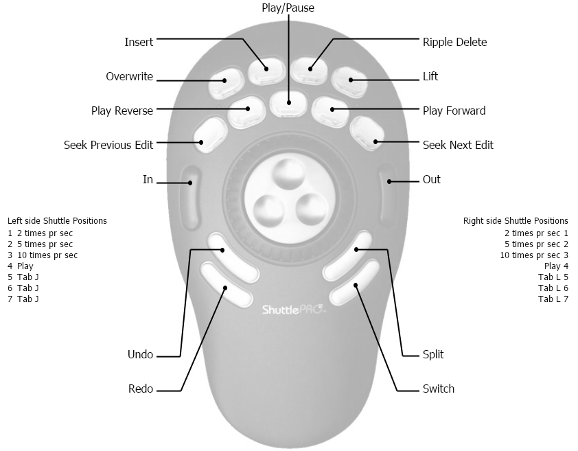

The [Contour ShuttlePRO](http://www.amazon.com/gp/product/B00027X2YM/ref=as_li_tl?ie=UTF8&camp=1789&creative=390957&creativeASIN=B00027X2YM&linkCode=as2&tag=shotvideedit-20&linkId=NH7YGQ27CG4JCFEQ)
is a USB controller that provides some special functions that are very
useful for video editing. A jog/shuttle controller features a wheel or
knob called the jog wheel with an outer ring called the shuttle. Shuttle
refers to playback speed and direction, and jog means to step
frame-by-frame. Shotcut does not yet contain programming to take full
advantage of this device, but power user tin2tin provided some
information about how to use the Contour generic software to control
Shotcut.

You can [download his Contour preferences
file](Shotcut_ContourShuttleProV2.pref). This was developed
and tested on Windows. It may or may not work on other operating
systems.

<noscript>Please enable JavaScript to view the <a href="http://disqus.com/?ref_noscript">comments powered by Disqus.</a></noscript>
<a href="http://disqus.com" class="dsq-brlink">comments powered by Disqus</a>
