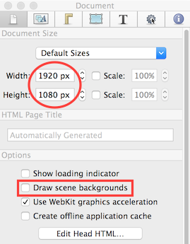
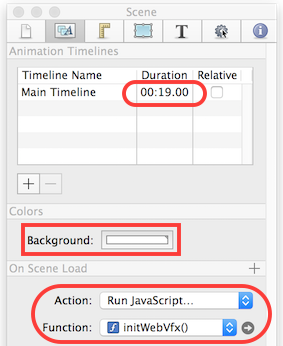
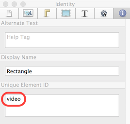

<!-- Shotcut Responsive -->
<ins class="adsbygoogle"
    style="display:block"
    data-ad-client="ca-pub-1305424236533187"
    data-ad-slot="3403753557"
    data-ad-format="auto"></ins>

[Tumult Hype](http://tumult.com/hype/) is a HTML5 animation program for
macOS. It is proprietary, but inexpensive and easy-to-use. More
importantly, it is easy to integrate with Shotcut. What do I mean by
"integrate?" Sure, Shotcut will let you drop in an animation, but the
timing will be messed up without some integration - specifically the
integration of *time*. Without it, the animation will appear to start at
some random time or stuck on the last frame while previewing. Upon
encoding, the time between frames will not be smooth because encoding
does not operate in real time. Some times between frames may be too
short or too long depending upon how fast rendering and encoding occurs.

<iframe width="640" height="360" src="//www.youtube.com/embed/TE8y4xKs9v4" frameborder="0" allowfullscreen="1"></iframe>

The Hype documentation and web site has good information about how to
create an animation. We will not cover that here. Instead, I will show
you how to setup your Hype project.

Document Properties
-------------------

In the Document Inspector, set the **Width** and **Height** to the same
resolution as your video project.

If you are only going to overlay this animation over your video and not
actually integrate the video into the animation as a HTML element, then
you want to uncheck **Draw scene backgrounds** to make the animation's
background transparent.

Scene Properties
----------------

In the Scene Inspector, adjust the timeline
**Duration** as needed. Maybe you want it to match the duration of your
trimmed clip in Shotcut. If you only want to use a portion of the video
clip, then plan to split the clip or insert multiple shots and just trim
out the shot you intend to overlay with HTML animation.

You only need to set the **Background** color if **Draw scene
backgrounds** is checked in the Document Inspector above.

The next step is the most important part. On the **On Scene Load**
section header, click **+**. In the Action drop-down menu, choose **Run
JavaScript...**

&nbsp;

In the Function drop-down menu, choose **New Function...** A new tab
appears in the main document window with some code in it. Put the
following code into the function:

~~~~ javascript
if (webvfx !== undefined) {
    function render(progress) {
            var duration = hypeDocument.durationForTimelineNamed();
            hypeDocument.goToTimeInTimelineNamed(progress * duration);
    }
    webvfx.renderRequested.connect(hypeDocument, render);
    webvfx.readyRender(true);
}
~~~~
If you want to, you can rename the function to something meaningful as I
have.

The function call to webvfx.renderRequested.connect() tells WebVfx
plugin for MLT, the engine of Shotcut, to call our custom render()
function whenever there is a new frame that needs rendering. When the
render function is called, WebVfx passes as an argument the frame time
as a floating point value in the range 0 - 1. Therefore, I prefer to
think of it as a progress value. Inside my render function, I multiply
the progress ratio with the timeline duration to compute a time value in
seconds (including sub-seconds). The time is passed to the hype function
goToTimeInTimelineNamed(), which seeks to the requested time and
redraws.

Putting Shotcut Video Into Hype
-------------------------------

Did you know that you can actually put the
Shotcut video into the HTML composition to manipulate it? You will not
be able to see it while working in the Hype tool, but you can still
visualize it, and make it appear as expected within Shotcut. In Hype,
add a rectangle, rounded rectangle, or ellipse shape element to act as a
place-holder for the video. Then, while it is selected, switch to the
Identity tab of the Inspector. For the **Unique Element ID**, enter the
value "video".

&nbsp;

Next, switch to the Scene tab, scroll down to the On Scene Load, and
either add this JavaScript, or change the existing code to look like
this.

~~~~ javascript
if (typeof webvfx !== 'undefined') {
    var div = document.getElementById('video');
    var image = new Image();
    div.appendChild(image);

    function render(progress) {
        var duration = hypeDocument.durationForTimelineNamed();
        webvfx.getImage("video").assignToHTMLImageElement(image);
        image.style.width  = div.style.width;
        image.style.height = div.style.height;
        hypeDocument.goToTimeInTimelineNamed(progress * duration);
    }

    webvfx.renderRequested.connect(hypeDocument, render);
    webvfx.imageTypeMap = { "video" : webvfx.SourceImageType };
    webvfx.readyRender(true);
}
~~~~

First, we get the Hype shape element we identified with "video." Then, we
make a new HTML image object and add it within the shape. Inside the
render function we instruct WebVfx to update our image object with the
image from the current video frame. At this point, you can animate the
shape's size and position as you would like.

Export
------

After making the animation, of course, you must export it from Hype as
HTML. Choose File > Export as HTML5 > Folder.... When you export,
Hype automatically inserts your custom JavaScript into the exported
files. Now, you can simply point the Shotcut Overlay HTML filter at the
file you exported, but before you click the **Open...** button make sure
you enable the checkbox **Enable WebVfx JavaScript extension**!
