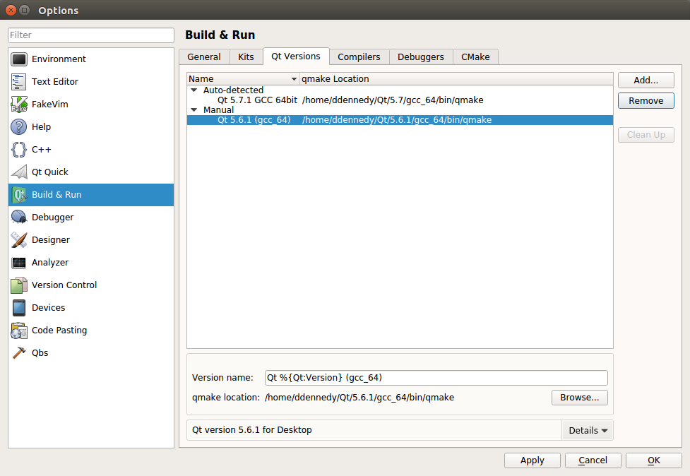
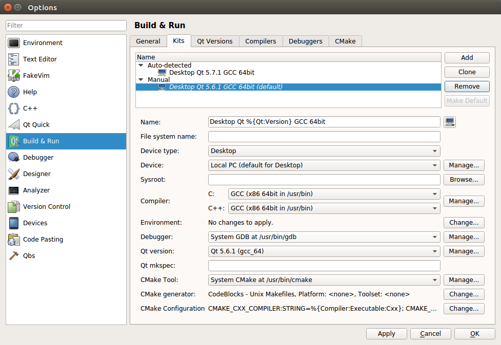

1. Download and install the following:
  - Qt Creator from the [Qt project](https://www.qt.io/download-open-source/) or your distribution packages.
  - [Our special build of the Qt 5.9.7 SDK that includes QtWebKit](https://s3.amazonaws.com/misc.meltymedia/shotcut-build/qt-5.9.7-ubuntu16.04-x86_64.txz)    
    Extract it to $HOME/Qt
  - [Shotcut SDK (611 MiB! current version 19.12.31)](http://builds.us.meltytech.s3.amazonaws.com/shotcut/shotcut-linux-x86_64-sdk-191231.txz)    
    Extract it to $HOME/Projects

2. Start Qt Creator and choose **Tools &gt; Options &gt; Build &amp; Run**  
Configure all of your settings in the Build & Run section.
  - Manually set the Qt version.
  
  - Configure the project kit from the previously set Qt version.
    

3. Extract the Shotcut SDK .bz2 file to a new folder in $HOME called "Projects".
4. In Qt Creator open shotcut.pro from $HOME/Projects/Shotcut/Shotcut.app/src/shotcut.
5. In the Shotcut project configuration screen find **Build Settings**.  
   - Under **Build steps &gt; qmake &gt; Additional arguments** add  
   `MLT_PATH=../../.. PREFIX=../../..`
   - Under **Build Steps &gt; Make &gt; Make arguments** add "-j" for faster parallel compilation.
6. In the Shotcut project configuration screen find **Run Settings**.  
   - Under **Deployment** click **Add Deploy Step &gt; Make**, and in **Make arguments** add "install".  
   - Under **Run &gt; Run configuration** click **Add &gt; Custom Executable &gt; Executable** add   `$HOME/Projects/Shotcut/Shotcut.app/bin/shotcut`
   - Under **Run Environment &gt; Details** add the following environment variables:
     - Set `LD_LIBRARY_PATH` to `${HOME}/Projects/Shotcut/Shotcut.app/lib:${QTDIR}/lib:${HOME}/Projects/Shotcut/Shotcut.app/src/build-shotcut-Desktop_Qt_5_6_1_GCC_64bit-Debug/CuteLogger`
     - Set `MLT_DATA` to `${HOME}/Projects/Shotcut/Shotcut.app/share/mlt`
     - Set `MLT_PRESETS_PATH` to `${HOME}/Projects/Shotcut/Shotcut.app/share/mlt/presets`
     - Set `MLT_PROFILES_PATH` to `${HOME}/Projects/Shotcut/Shotcut.app/share/mlt/profiles`
     - Set `MLT_REPOSITORY` to `${HOME}/Projects/Shotcut/Shotcut.app/lib/mlt`
     - Set `QML2_IMPORT_PATH` to `${QTDIR}/qml`
     - Set `QT_PLUGIN_PATH` to `${QTDIR}/plugins`

7. Go back to **Edit** mode, right-click "shotcut" in the project tree, and choose **Rebuild**.

8. After clicking **Run**, you can confirm the newly built executable is the one
   that is running from the **About** dialog: the version will be today's date.
