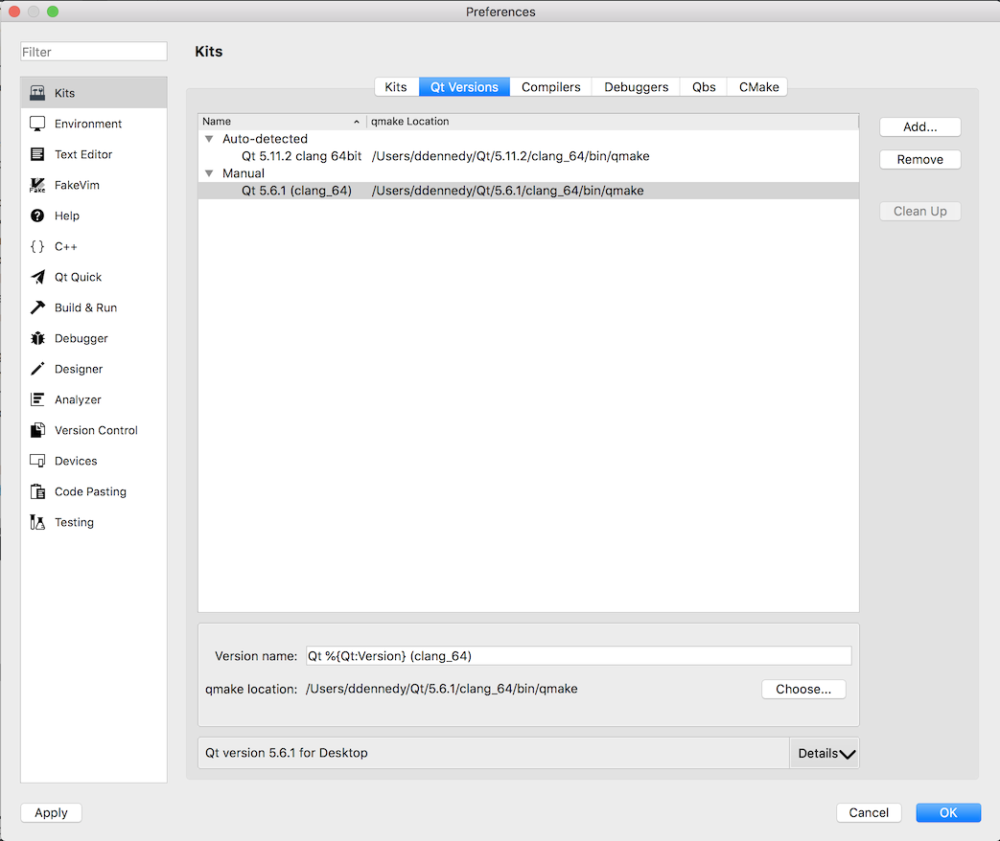
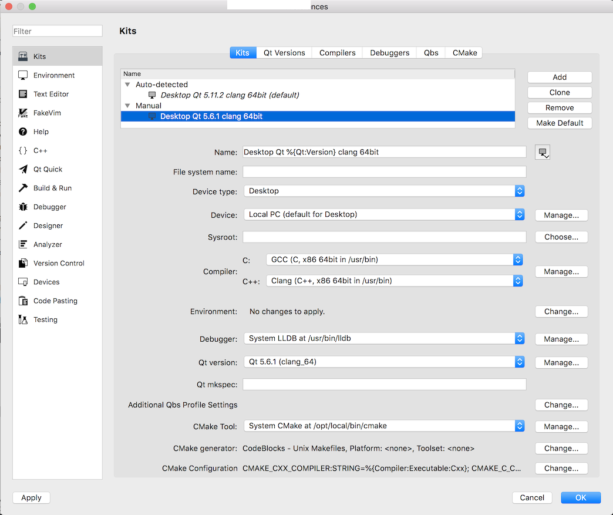

1. Download and install the following:
  - Qt Creator from the [Qt project](https://www.qt.io/download-open-source/) or your distribution packages.
  - [Our special build of the Qt 5.9.7 SDK that includes QtWebKit](https://s3.amazonaws.com/misc.meltymedia/shotcut-build/qt-5.9.7-macos-x86_64.txz)    
    Extract it to $HOME
  - [Shotcut SDK (660 MiB! current version 20.06.28)](http://builds.us.meltytech.s3.amazonaws.com/shotcut/shotcut-macos-sdk-200628.txz)    
    Extract it to $HOME/Projects

2. Start Qt Creator and choose **Qt Creator &gt; Preferences... &gt; Kits**  
Configure all of your settings in the Kits section.
  - Manually set the Qt version.
  
  - Configure the project kit from the previously set Qt version.
    

3. Extract the Shotcut SDK .txz file to a new folder in $HOME called "Projects".
4. In Qt Creator open shotcut.pro from $HOME/Projects/Shotcut/src/shotcut.
5. In the Shotcut project configuration screen find **Build Settings**.  
   - Under **Build steps &gt; qmake &gt; Additional arguments** enter  
   `PREFIX=../../.. QMAKE_RPATHDIR=@executable_path/../Frameworks`
   - Under **Build Steps &gt; Make &gt; Make arguments** add "-j" for faster parallel compilation.
6. In the Shotcut project configuration screen find **Run Settings**.  
   - Under **Deployment** click **Add Deploy Step &gt; Make**, and in **Make arguments** add "install".  
   - Under **Deployment** click **Add Deploy Step &gt; Custom Process Step**,
   in **Command** enter "cp", and in **Arguments** enter  
   `-p src/Shotcut.app/Contents/MacOS/Shotcut ../../Contents/MacOS`
   - Under **Run &gt; Run configuration** click **Add &gt; Custom Executable &gt; Executable** add   `$HOME/Projects/Shotcut/Contents/MacOS/Shotcut`
   - Under **Run Environment &gt; Details** add the following environment variables:
   - Set `QML2_IMPORT_PATH` to `${QTDIR}/qml`
   - Set `QT_PLUGIN_PATH` to `${QTDIR}/plugins`

<!--
     - Set `MLT_DATA` to `${HOME}/Projects/Shotcut/src/mlt/src/modules`
     - Set `MLT_PRESETS_PATH` to `${HOME}/Projects/Shotcut/src/mlt/presets`
     - Set `MLT_PROFILES_PATH` to `${HOME}/Projects/Shotcut/src/mlt/profiles`
     - Set `MLT_REPOSITORY` to `${HOME}/Projects/Shotcut/src/mlt/src/modules`
-->


8. After clicking **Run**, you can confirm the newly built executable is the one
   that is running from the **About** dialog: the version will be today's date.


Rebuilding Dependencies {#rebuilding-dependencies}
-----------------------

You still might need to get some dependencies from MacPorts (or Homebrew, untested).

You can use the following command to revise all of the pkg-config files to
your installation path:

`for f in Shotcut/Contents/Frameworks/lib/pkgconfig/*.pc; do sed -i .bak -e "s,/Users/ddennedy/BuildAgent/work/ef55b932ce3c3e94/shotcut/build,$HOME/Projects/Shotcut/Contents/Frameworks," -e 's,Frameworks/lib,Frameworks,' -e 's,${exec_prefix}/lib,${exec_prefix},' $f ; done`

You might want to put the following into ~/.profile or a setup script:

```
export PATH="$HOME/Projects/Shotcut/Contents/MacOS:$PATH"
export QTDIR="$HOME/Qt/5.8.7/clang_64"
export PKG_CONFIG_PATH="$HOME/Projects/Shotcut/Contents/Frameworks/lib/pkgconfig"
export CFLAGS="-I/opt/local/include -DRELOCATABLE"
export CXXFLAGS="$CFLAGS"
export LDFLAGS="-L/opt/local/lib/libomp"
```

Sometimes, you need to `make distclean` and re-run `configure` to make a clean
in-tree (non-shadow) build. MLT has a `./reconfigure` script that invokes the
configure with the same arguments as the previous run.
