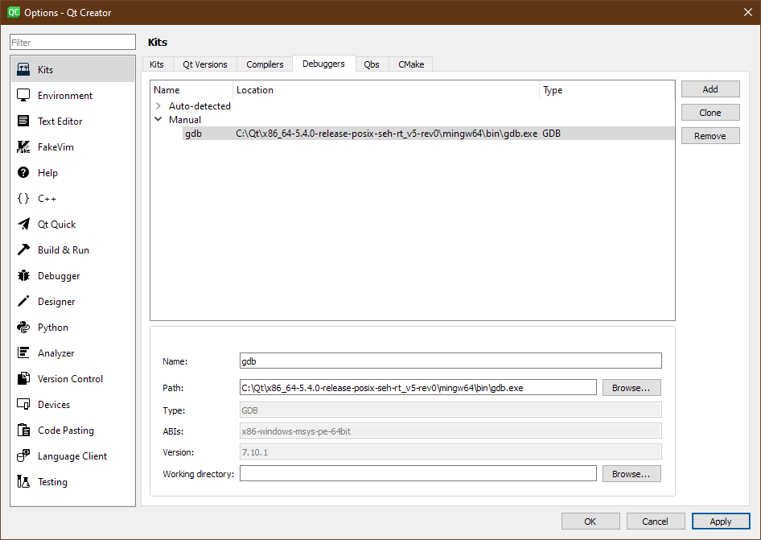
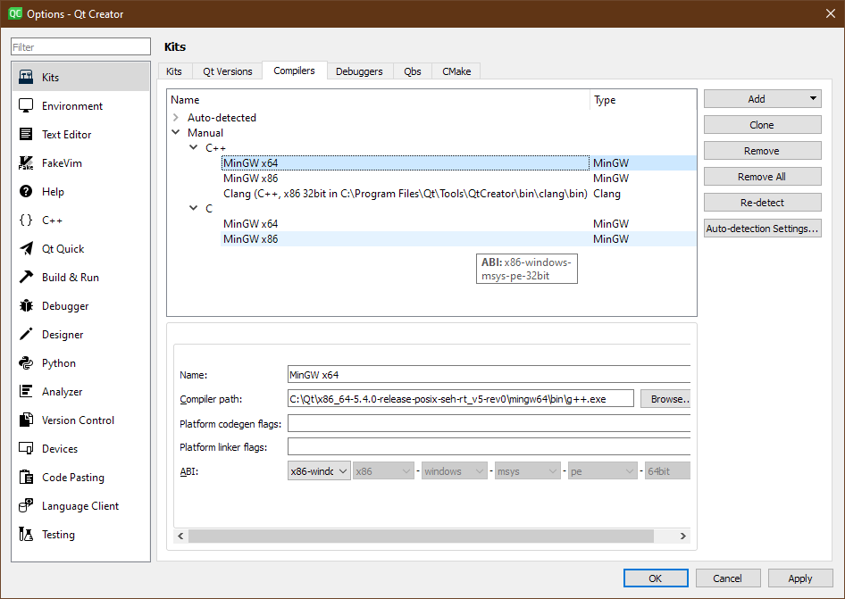
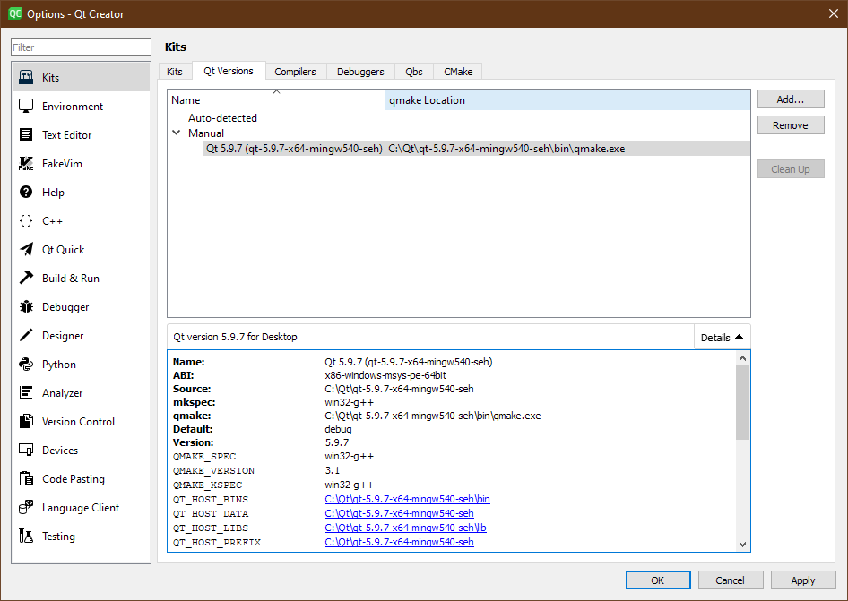
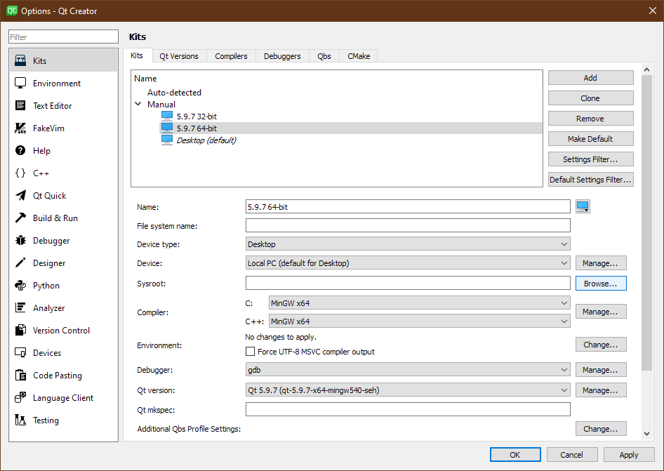
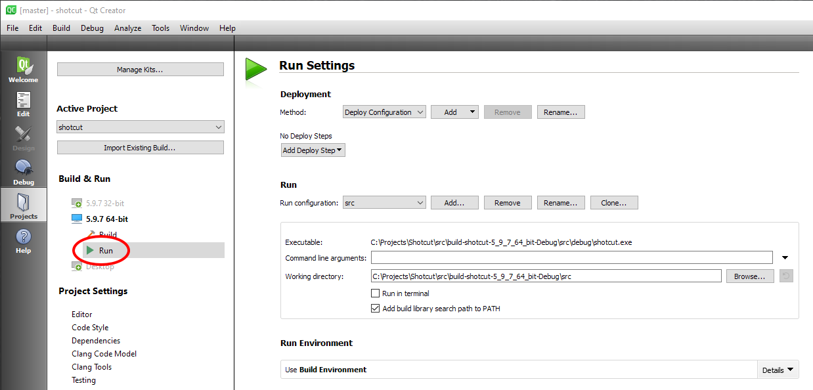

Support for this is not available. This is mainly for the lead developer
documenting his steps for future use in case he needs to do it again.

1. Download and install the following:
  - [Qt](https://www.qt.io/download-open-source/)
  - [Qt Creator](https://www.qt.io/download-open-source/)
  - [MinGW for Windows 64 bit, version 5.1](https://sourceforge.net/projects/qt64ng/files/qt/x86-64/5.5.0/mingw-5.1/seh/)
  - [Shotcut SDK (current version 16.12.03)](http://builds.us.meltytech.s3.amazonaws.com/shotcut/shotcut-win64-sdk-161203.zip)

2. Place/ensure the following folders and files are in the correct directories:
  - C:\Qt\qt-5.5.0-x64-mingw510r0-seh-rev0\mingw64\bin\g++.exe
  - C:\Qt\qt-5.5.0-x64-mingw510r0-seh-rev0\qt-5.5.0-x64-mingw510r0-seh-rev0\bin\qmake.exe
  - C:\Qt\Tools\mingq483_32 <- This should be an entire folder.

3. In Qt Creator, choose Tools > Options > Build & Run > Kits.
Configure all of your settings in the Build & Run section.
  - Manually set the debugger to MinGW's gdb.exe.
  
  - Manually set the compiler to MinGW's g++.exe
  
  - Manually set the Qt version to MinGW's.
  
  - Configure the project kit from the previously set debug, compiler, and Qt versions.
    

4. Use the Shotcut SDK and extract the .zip
file to a new folder in C: called Projects. (like this: C:\Projects)
5. Run Qt Creator and open shotcut.pro from C:\Projects\Shotcut\src\shotcut
6. In the Shotcut project configuration screen find Run Settings.
  - Deployment > Add Deploy Step > Make. In Make arguments, enter "install"
  - Run > Add a Run Configuration > Custom Executable. Set Executable to C:\Projects\Shotcut\shotcut.exe
     and set Working directory to C:\Projects\Shotcut
    

7. Set your build settings in the Shotcut project configuration so that the build steps include MinGW make steps.
    
8. You can confirm the newly built executable is the one that is running from the About
   dialog: the version will be "adhoc."

### Final Project

Rebuilding Dependencies {#rebuilding-dependencies}
-----------------------

The section above just gets you a working environment for the Shotcut
code, but not any of its dependencies. Some of the dependencies included
in the SDK with source code can be opened and used within Qt Creator -
frei0r and webvfx. Instructions for that are not yet included. In other
cases you can use the Git Bash shell environment. Upon opening a Git
Bash shell, enter (or add to ~/.profile and restart the shell):

    export BASE="/Qt/qt-5.5.0-x64-mingw510r0-seh-rev0"
    export PATH="/c$BASE/mingw64/bin:$PATH"
    export QTDIR="c:$BASE/qt-5.5.0-x64-mingw510r0-seh-rev0"
    export CC=gcc
    export CXX=g++
    export PKG_CONFIG_PATH="c:/Projects/Shotcut/lib/pkgconfig"
    export CFLAGS="-Ic:/Projects/Shotcut/include -DHAVE_STRUCT_TIMESPEC"
    export CXXFLAGS="$CFLAGS"
    export LDFLAGS="-Lc:/Projects/Shotcut/lib -Lc:/Projects/Shotcut"
    alias make=mingw32-make

For a project's configure step, often you can supply the prefix as
`/c/Projects/Shotcut` and `make install` will work as expected. However,
sometimes you need to copy DLLs from bin/ or lib/ into
/c/Projects/Shotcut where shotcut.exe resides.

When working with git repos from the SDK on Windows, it can helpful to
issue `git config core.fileMode false` to prevent unchanged files from
appearing in git status and git diff.

Command Line Debugging {#command-line-debugging}
----------------------

When using gdb at the command line to debug, using Ctrl+C to break
execution will also exit the debugger. There is a program called
[breakgdb.exe](https://s3.amazonaws.com/misc.meltymedia/shotcut-build/breakgdb.exe) ([source](https://s3.amazonaws.com/misc.meltymedia/shotcut-build/debugbreak.c)) that can be used to break
execution.
