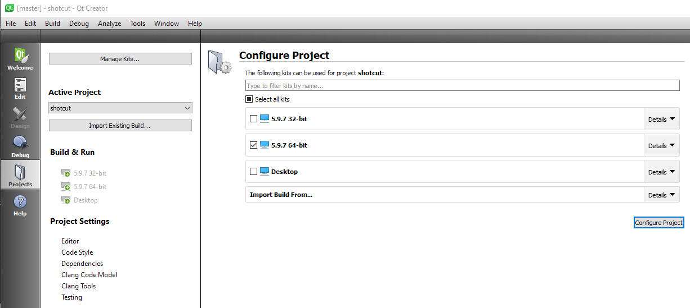
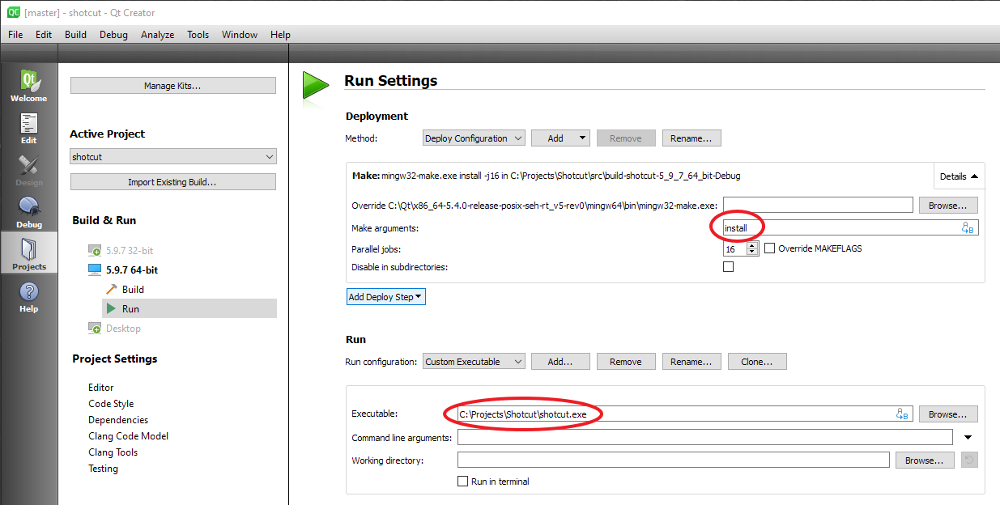

1. Download and install the following:

  - [Qt Creator](https://www.qt.io/download-open-source/)
  - Qt SDK version 5.15 MinGW
  - [Shotcut SDK (2.3 GB current version 22.12.21)](https://s3.amazonaws.com/builds.us.meltytech/shotcut/shotcut-win64-sdk-221221.zip)  
    Extract it to `C:\Projects`

2. Extract the Shotcut SDK .zip file to a new folder in `C:\` named "Projects" (`C:\Projects`).
3. In Qt Creator open `C:\Projects\Shotcut\src\shotcut\CMakeLists.txt`.
4. In the **Configure Project** screen, select your previously configured Kit
   and click **Configure Project**:
   

5. Click **Projects** in the navigation bar on the left side of the Qt Creator window.  
  - In the left column of the Shotcut project configuration click **Build**
    to show the **Build Settings**:
  - In **Build Environment** add environment variable `PKG_CONFIG_PATH` and set it to `C:\Projects\Shotcut\lib\pkgconfig`.
  - Prepend msys2 binary folders to environment variable `Path`: `C:\msys64\usr\local\bin;C:\msys64\mingw64\bin;`
  - In **CMake &gt; Current Configuration** find `CMAKE INSTALL_PREFIX` and change its value to `C:\Projects\Shotcut` and click **Run CMake**.

5. In the left column of the Shotcut project configuration click **Run**
   to show the **Run Settings**:
    

  - In **Run** click **Add... &gt; Custom Executable**;  
    in **Executable:** enter "C:\Projects\Shotcut\shotcut.exe":
    

6. After clicking **Run** (the green play button in bottom left of Qt Creator),
   you can confirm the newly built executable is the one that is running from the
   **Help &gt; About Shotcut...** dialog: the version will be "adhoc".

### Final Project

Rebuilding Dependencies {#rebuilding-dependencies}
-----------------------

The section above just gets you a working environment for the Shotcut
code, but not any of its dependencies. Some of the dependencies included
in the SDK with source code can be opened and used within Qt Creator -
e.g., frei0r. Instructions for that are not yet included. In other
cases you can use the Git Bash shell environment. Upon opening a Git
Bash shell, enter (or add to ~/.profile and restart the shell):

    export PATH="/c/Qt/x86_64-5.4.0-release-posix-seh-rt_v5-rev0/mingw64/bin:$PATH"
    export QTDIR="c:/Qt/qt-5.9.7-x64-mingw540-seh"
    export CC=gcc
    export CXX=g++
    export PKG_CONFIG_PATH="c:/Projects/Shotcut/lib/pkgconfig"
    export CFLAGS="-Ic:/Projects/Shotcut/include -DHAVE_STRUCT_TIMESPEC"
    export CXXFLAGS="$CFLAGS"
    export LDFLAGS="-Lc:/Projects/Shotcut/lib -Lc:/Projects/Shotcut"
    alias make=mingw32-make

For a project's configure step, often you can supply the prefix as
`/c/Projects/Shotcut` and `make install` will work as expected. However,
sometimes you need to copy DLLs from bin/ or lib/ into
/c/Projects/Shotcut where shotcut.exe resides.

When working with git repos from the SDK on Windows, it may helpful to
issue `git config core.fileMode false` to prevent unchanged files from
appearing in git status and git diff.

Command Line Debugging {#command-line-debugging}
----------------------

When using gdb at the command line to debug, using Ctrl+C to break
execution will also exit the debugger. There is a program called
[breakgdb.exe](https://s3.amazonaws.com/misc.meltymedia/shotcut-build/breakgdb.exe) ([source](https://s3.amazonaws.com/misc.meltymedia/shotcut-build/debugbreak.c)) that can be used to break
execution.
